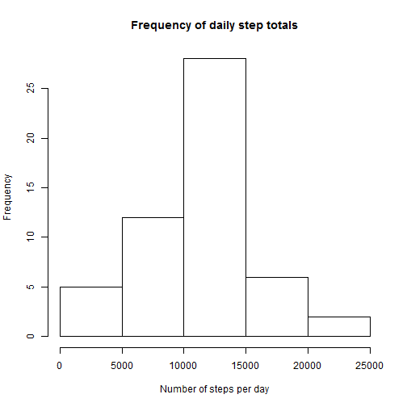
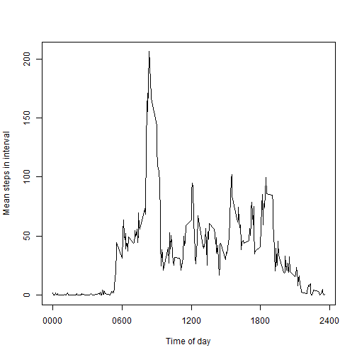
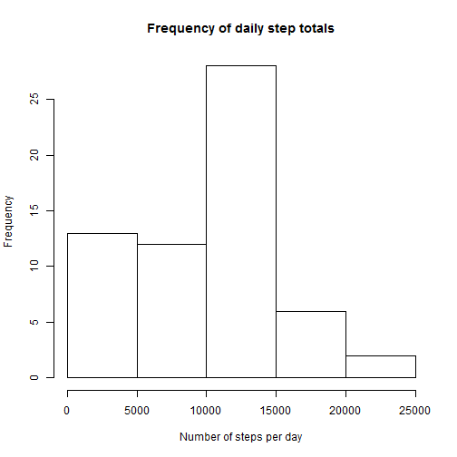
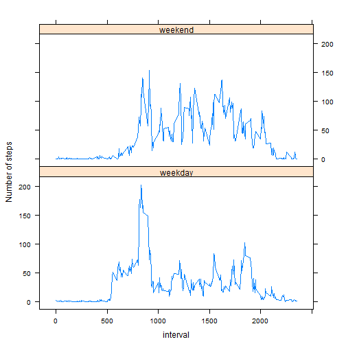

## Loading and preprocessing the data

Before any analysis can be performed the data must first be loaded. It is assumed that the zip file of
measurements has already been downloaded, and the CSV file extracted into the current working directory.  

Hence read in the data, and ensure that the column related to dates is actually treated as a Date type.


```r
activity <- read.csv( "./activity.csv", header=TRUE )
activity$date <- as.Date(activity$date, "%Y-%m-%d")
```
   
   

## What is mean total number of steps taken per day?

For the first analysis we are told that 'you can ignore missing values'. Reading the course support forums
shows that this is open to a number of interpretations.  

Firstly, let's produce a histogram of the total number of steps taken each day.  


```r
stepsPerDay <- aggregate(steps ~ date, data=activity, sum)
hist(stepsPerDay$steps, 
     main="Frequency of daily step totals",
     xlab="Number of steps per day")
```

 

We can also calculate the mean and median total number of steps taken per day.  


```r
meanStepsPerDay <- as.integer(mean(stepsPerDay$steps))
medianStepsPerDay <- as.integer(median(stepsPerDay$steps))
```
   
The mean total steps per day is 10766.
The median total steps per day is 10765.
  
  
## What is the average daily activity pattern?

Now, let us look at the activity pattern during the day. Average out the activity in the same interval of each day, and then look
at that 'average' day.  
   

```r
meanStepsPerInterval <- aggregate(steps ~ interval, data=activity, mean)
with(meanStepsPerInterval, plot(interval, 
                            steps, 
                            type="l",
                            xaxt="n",
                            xlab="Time of day",
                            ylab="Mean steps in interval"))
axis(1, 
     at=c(0,600,1200,1800,2400),
     labels=c('0000', '0600', '1200', '1800', '2400'))
```

 

There is obviously a peak in activity at one time in the day.


```r
busiestInterval <- which.max(meanStepsPerInterval$steps)
busiestHour <- (busiestInterval * 5) %/% 60
busiestMinute <- (busiestInterval * 5) %% 60
```
   
That is the 104 interval, which occurs at 8:40.   

## Imputing missing values

There are quite a few intervals with no step data. It is instructive to find out how many.
   

```r
numberOfMissingValues <- sum(is.na(activity$steps))
```

Since 2304 is a large number, these missing values may may well be influencing the previous figures. 
There are many ways in which the missing values could be interpolated. We have chosen a simple linear interpolation between 
the previous and next values which are present.   

First, add an additional column to our existing data set, containing this imputed data.  


```r
library(zoo)
activity[1,1] <- 0
activity[17568,1] <- 0
imputedSteps <- na.approx(activity$steps)
activity <- cbind(activity, imputedSteps)
```

We can now graph that data, and calculate the revised mean and median total number of steps per day.


```r
imputedStepsPerDay <- aggregate(imputedSteps ~ date, data=activity, sum)
hist(imputedStepsPerDay$imputedSteps, 
     main="Frequency of daily step totals",
     xlab="Number of steps per day")
```

 

```r
imputedMeanStepsPerDay <- as.integer(mean(imputedStepsPerDay$imputedSteps))
imputedMedianStepsPerDay <- as.integer(median(imputedStepsPerDay$imputedSteps))
```

Producing a revised mean steps per day of 9354, and a revised median steps per day of 10395.   

So we can see that imputing the missing values using linear interpolation has the effect of reducing the mean and median values.   
   

## Are there differences in activity patterns between weekdays and weekends?

Now, it is quite likely that people will have different patterns of activity during the working week compared to at weekends.

First, add another column to our activity set to flag whether each reading is from a weekday or the weekend.   


```r
dayType <- as.factor(ifelse(weekdays(activity$date) %in% c("Saturday", "Sunday"), "weekend", "weekday"))
activity <- cbind(activity, dayType)
```

And we can now create comparative plot for weekday and weekend activity.


```r
library(lattice)
meanImputedStepsPerInterval <- aggregate(imputedSteps ~ interval + dayType, data=activity, mean)
xyplot(imputedSteps ~ interval | dayType, 
       data=meanImputedStepsPerInterval,
       layout=c(1,2),
       type="l",
       ylab="Number of steps")
```

 

